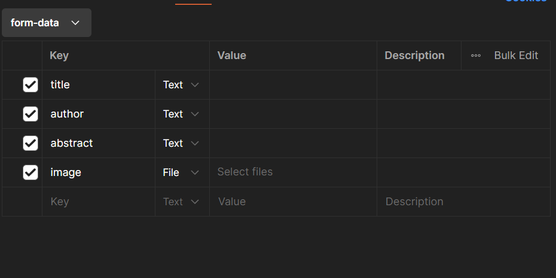

# STEPLIST CREAZIONE WEBAPP LIBRERIA (PASSO PER PASSO)

Questa webapp avrà un db di libri a cui possiamo inserire delle recensioni!

Iniziamo con i passaggi per crearla.

---

## 1) CREAZIONE DATABASE

---

**DOMANDA: COS'È UN DATABASE?**

**RISPOSTA:**

Un database è un sistema che serve a raccogliere, organizzare e gestire dati in modo strutturato, così che possano essere facilmente consultati, modificati e mantenuti.

È come un archivio digitale:

1. una libreria -> è il database
2. gli scaffali -> sono le tabelle
3. i libri sugli scaffali -> sono i record (righe)
4. le informazioni in un libro (titolo, autore, anno) -> sono i campi (colonne)

---

Dopo aver capito cos'è un database, iniziamo!

### 1) Identifichiamo le tabelle `Books` e `Reviews` con i loro campi:

**Books table**

* `id` primary key
* `title`
* `author`
* `image`
* `abstract`

**Reviews table**

* `id` primary key
* `books_id` foreign key
* `name`
* `vote`
* `text`

La relazione tra questi due sarà **one (Books) to many (Reviews)**, siccome un libro può avere più recensioni, ma una recensione appartiene a un solo libro.

### 2) Creiamo il db su MySQL Workbench — passaggi iniziali

1. Se non hai ancora creato una MySQL Connection, creiamone una:

   * Apri MySQL Workbench.
   * Vicino a *MySQL Connections* clicca il `+` alla sua destra.
   * Inserisci il nome della connection (puoi mettere quello che vuoi).
   * Inserisci lo username (ci servirà poi nel progetto).
   * Fai *Test Connection* e verifica che sia andato tutto correttamente.
   * Clicca **OK**.

   *Ora abbiamo il connector per il db!*

2. Clicca sulla connection appena creata per aprirla.

Per creare un database:

* Nella barra a sinistra (SCHEMAS) clicca con il tasto destro del mouse (sotto a tutto) e seleziona **Create Schema...**
* Inserisci il nome del database (ricordalo!).
* Clicca **Apply** e conferma.

Se non hai un file SQL per scrivere query, in MySQL Workbench clicca il pulsante `SQL` (icona foglio con `SQL`) per aprire un nuovo editor SQL (in basso a sinistra c'è un `+`).

*Così crei un file SQL dove scrivere le query.*

---

**NOTA:** se hai già un database sul tuo computer, invece di crearne uno nuovo puoi importarlo:

1. Seleziona il tuo database vuoto.
2. In alto vai su **Server → Data Import**.
3. Seleziona **Import from Self-Contained-File**.
4. Clicca `[...]` per selezionare il file `.sql` da importare.
5. Scegli il file `.sql` che contiene il database.
6. In **Default Target Schema** seleziona il database di destinazione.
7. Clicca **Start Import**.

Se tutto va bene vedrai *Import completed* senza errori. Se hai importato il DB, salta alla sezione 2 → CREAZIONE PROGETTO WEBAPP.

---

### Creazione manuale del database (esempio)

Esempio di query per creare un database di libri (`db_books`):

```sql
-- Creazione del database
CREATE DATABASE db_books;

-- Seleziono il database
USE db_books;

-- Creazione tabella Books
CREATE TABLE Books (
    id INT AUTO_INCREMENT PRIMARY KEY,
    title VARCHAR(255) NOT NULL,
    author VARCHAR(255) NOT NULL,
    image VARCHAR(500),
    abstract TEXT
);

-- Creazione tabella Reviews
CREATE TABLE Reviews (
    id INT AUTO_INCREMENT PRIMARY KEY,
    books_id INT NOT NULL,
    name VARCHAR(255) NOT NULL,
    vote INT CHECK (vote BETWEEN 1 AND 5),
    text TEXT,
    FOREIGN KEY (books_id) REFERENCES Books(id)
        ON DELETE CASCADE
        ON UPDATE CASCADE
);
```

### 3) Inseriamo qualche dato (esempio)

**Inserimento libri**:

```sql
INSERT INTO Books (title, author, image, abstract)
VALUES
('Il nome della rosa', 'Umberto Eco', 'Il_nome_della_rosa.jpg', 'Un romanzo storico ambientato in un monastero medievale con un mistero da risolvere.'),
('1984', 'George Orwell', '1984.jpg', 'Un classico della distopia che descrive un futuro totalitario e oppressivo.'),
('Il Signore degli Anelli', 'J.R.R. Tolkien', 'il_signore_degli_anelli.jpg', 'Un’epica avventura fantasy ambientata nella Terra di Mezzo.'),
('Orgoglio e pregiudizio', 'Jane Austen', 'orgoglio_e_pregiudizio.jpg', 'Un romanzo che esplora i temi dell’amore, del matrimonio e delle convenzioni sociali.'),
('Cronache di Narnia: Il leone, la strega e l’armadio', 'C.S. Lewis', 'le_cronache_di_narnia.jpg', 'Un classico fantasy per ragazzi con simbolismi profondi e avventure magiche.');
```

**ATTENZIONE:** se vuoi inserire tu un'altra immagine, puoi fare questo tramite un `UPDATE`:

```sql
UPDATE Books
SET image = 'NOME_FOTO.jpg'
WHERE id = ID_DEL_LIBRO; -- es. ID_DEL_LIBRO = 1 per "Il nome della rosa"
```

**Inserimento recensioni**:

```sql
INSERT INTO Reviews (books_id, name, vote, text)
VALUES
-- Recensioni per "Il nome della rosa" (id = 1)
(1, 'Marco Rossi', 5, 'Un capolavoro assoluto, avvincente e colto.'),
(1, 'Giulia Bianchi', 4, 'Molto bello, ma a tratti un po’ complesso.'),
(1, 'Andrea Conti', 5, 'Intrigante e scritto in modo magistrale.'),

-- Recensioni per "1984" (id = 2)
(2, 'Luca Verdi', 5, 'Un libro che fa riflettere, sempre attuale.'),
(2, 'Anna Neri', 3, 'Interessante, ma la narrazione a volte è lenta.'),
(2, 'Francesca Blu', 4, 'Distopico e intenso, mi ha colpito molto.'),

-- Recensioni per "Il Signore degli Anelli" (id = 3)
(3, 'Davide Gialli', 5, 'Il fantasy per eccellenza, indimenticabile.'),
(3, 'Sara Rosa', 5, 'Tolkien ha creato un mondo unico, emozionante.'),
(3, 'Marta Viola', 4, 'Bellissimo ma molto lungo.'),

-- Recensioni per "Orgoglio e pregiudizio" (id = 4)
(4, 'Chiara Azzurri', 5, 'Un classico senza tempo, adorabile.'),
(4, 'Elena Grigi', 4, 'Stile elegante, personaggi ben caratterizzati.'),
(4, 'Paolo Neri', 3, 'Interessante ma non il mio genere.'),

-- Recensioni per "Cronache di Narnia" (id = 5)
(5, 'Simone Marrone', 5, 'Magico e pieno di simbolismi, perfetto per ragazzi.'),
(5, 'Alessia Lilla', 4, 'Una storia avvincente, anche se semplice.'),
(5, 'Giovanni Fucsia', 5, 'Un’avventura meravigliosa che mi ha segnato da bambino.');
```

---

## 2) CREAZIONE PROGETTO WEBAPP

Dopo aver creato il DB (o importato quello esistente) e inserito i dati, creiamo il progetto Node/Express:

1. Crea la cartella del progetto e aprila con VSCode. Esegui `npm init`.
2. Installa Express e mysql2:

```bash
npm install express mysql2
```

3. Crea `.gitignore` e aggiungi `node_modules/` e `.env` (poi vedremo il `.env`).
4. Aggiorna `package.json` aggiungendo gli script `start` e `watch` (vedi sezione .env per la versione con `--env-file`):

```json
"scripts": {
  "start": "node app.js",
  "watch": "node --watch app.js",
  "test": "echo \"Error: no test specified\" && exit 1"
}
```

5. Crea il file `app.js` con lo scheletro del server:

```js
const express = require('express');
const app = express();
const port = 3000;

app.get('/', (req, res) => {
  res.send('Server attivo');
});

app.listen(port, () => {
  console.log(`server in ascolto nella porta ${port}`);
});
```

6. Crea la cartella `data` e al suo interno `db.js`. Questo file conterrà la connessione al database.

`data/db.js`:

```js
// importiamo mysql2
const mysql = require('mysql2');

// creo la connessione
// NOTA: in password, user e database, inserisci i dati che hai messo quando hai creato la MySQL Connection!

const connection = mysql.createConnection({
    host: "localhost",
    user: "root",
    password: "password",
    database: "db_books",
    port: 3306
});

// stabilisco la connessione al db
connection.connect((err) => {
    if (err) {
        console.log(`Errore nella connessione al db: ${err}`);
    } else {
        console.log("Connessione al db avvenuta correttamente");
    }
});

// esporto connection
module.exports = connection;
```

7. In `app.js`, importa la connessione sotto `const express`:

```js
// connessione con il database in app.js
const connection = require('./data/db');
```

Così `app.js` sarà collegato al database.

---

## 3) CREAZIONE `.env`

**DOMANDA: COS'È L'.ENV E A CHE SERVE?**

**RISPOSTA:**

Il file `.env` serve per gestire le variabili d’ambiente del tuo progetto: valori che possono cambiare tra ambienti (sviluppo/test/produzione) senza modificare il codice.

A cosa serve in pratica:

1. Conserva dati sensibili (es. password DB, API key).
2. Permette di configurare l’app senza toccare i file .js.
3. È più sicuro perché viene inserito in `.gitignore`.
4. Consente di cambiare configurazioni velocemente (porta, user, db, ecc.).

### Creazione del file `.env` (contenuto):

```
PORT=3000
DB_HOST=localhost
DB_USER=root
DB_PASSWORD=password
DB_DATABASE=db_books
DB_PORT=3306
```

**NOTA:** assicurati che `DB_HOST`,`DB_USER`,`DB_PASSWORD`, `DB_PORT` e `DB_DATABASE` corrisponda ai della tua MySQL Connection.

### Aggiornamenti al progetto per usare `.env`:

1. Aggiungi `.env` a `.gitignore`.
2. Modifica `data/db.js` per usare `process.env`:

```js
// creo la connessione
const connection = mysql.createConnection({
    host: process.env.DB_HOST,
    user: process.env.DB_USER,
    password: process.env.DB_PASSWORD,
    database: process.env.DB_DATABASE,
    port: process.env.DB_PORT
});
```

3. Aggiorna gli script in `package.json` per passare il file `.env` (esempio con `node` che supporta `--env-file`):

```json
"scripts": {
  "start": "node --env-file=.env app.js",
  "watch": "node --env-file=.env --watch app.js",
  "test": "echo \"Error: no test specified\" && exit 1"
}
```

In questo modo, cambiando i valori in `.env` non occorre modificare il codice.

---

## 4) CREAZIONE CONTROLLER

**DOMANDA: COS'È IL CONTROLLER E A COSA SERVE?**

**RISPOSTA:**

Un controller:

1. Riceve le richieste HTTP (GET, POST, PUT, DELETE) dal client.
2. Interagisce con i modelli o direttamente con il DB per leggere/scrivere dati.
3. Prepara e invia la risposta al client (JSON/HTML).

Benefici:

* Separazione delle responsabilità tra logica di routing e accesso ai dati.
* Gestione degli errori con risposte HTTP appropriate (`res.status(500)`, `res.status(404)`, ecc.).

### Creazione del controller `bookController.js`:

* Crea la cartella `controllers` e crea il file `bookController.js`.
* Aggiungi uno scheletro del codice, con le funzioni `index` e `show`:

```js
// importiamo la connessione al db
const connection = require('../data/db');

// index
const index = (req, res) => {
    console.log('Metodo index');
}

// show
const show = (req, res) => {
    console.log('Metodo show');
}

module.exports = {
    index,
    show
}
```

(index e show saranno poi riempiti con le query.)

---

## 5) ROUTER

Crea la cartella `routers` e crea il file `bookRouter.js`:

Inseriamo all'interno di Bookrouter.js questo

```js
// importiamo express
const express = require('express');
// importiamo router
const router = express.Router();
// importiamo il controller
const bookController = require('../controllers/bookController');

// definizione delle rotte
// index
router.get('/', bookController.index);

// show
router.get('/:id', bookController.show);

module.exports = router;
```

Qui sopra stiamo importando Express, router e il nostro controller.

Importa il router in `app.js`:

```js
// importo il router
const bookRouter = require('./routers/bookRouter');

// definisco le rotte per i libri
app.use('/books', bookRouter);
```

Ora puoi testare le rotte con Postman (vedi sezione 7 → TEST POSTMAN).

---

## 6) QUERY

Sostituiamo i `console.log` con vere query nel controller.

in ### `controllers/bookController.js` — modifichiamo `index` e `show` nei seguenti:

```js
// index => recuperiamo tutta la tabella libri
const index = (req, res) => {
  const sql = 'SELECT * FROM books';

  connection.query(sql, (err, results) => {
      if (err)
          return res.status(500).json({ error: 'Errore durante la esecuzione della query: ' + err });
      res.json(results);
      console.log('index eseguito con successo!');
  });
}

// show => recuperiamo il singolo elemento di un libro
const show = (req, res) => {
  const { id } = req.params;
  const sql = 'SELECT * FROM books WHERE id = ?';

  connection.query(sql, [id], (err, results) => {
      if (err)
          return res.status(500).json({ error: 'errore nell\'esecuzione della query: ' + err });
      res.json(results);
      console.log('show eseguito con successo!');
  });
}
```

- index -> adesso, tramite il comando 'SELECT * FROM books', prenderà tutti i libri all'interno del nostro database.

- show -> adesso, tramite il comando 'SELECT * FROM books WHERE id = ?', prenderà il singolo libro in base all'id inserito.

Sia index che show, avranno dei check errors, che vengono visti tramite la value (err) 

### PASSAGGI EXTRA

1. **Check per vedere se non trovo un libro** 

In show, dopo aver fatto l'if (err), con il return dell'err, ci andiamo a mettere un'altro check, per vedere se non è presente quel libro:

```js
// controllo se non ho trovato il libro
if(resultBook.length === 0 || resultBook[0].id === null)
    return res.status(404).json({ error: 'Libro non trovato!' });
```

tramite un'error 404, mostriamo che il libro cercato non esiste.

2. **Array recensioni** 

in show, dopo aver fatto il check per vedere se esiste quel libro, vediamo di includerci nella show del libro anche le recensioni presenti nel database (sono più recensioni in un libro)

per fare ciò, dobbiamo modificare il codice della show:

```js
const sqlBook = 'SELECT * FROM books WHERE id = ?';
const sqlReviews = 'SELECT * FROM reviews WHERE books_id = ?';

// prima query: recupero il libro
connection.query(sqlBook, [id], (err, resultBook) => {
  if (err) return res.status(500).json({ error: 'errore nell\'esecuzione della query: ' + err });
  if (resultBook.length === 0) return res.status(404).json({ error: 'Libro non trovato!' });

  // query per recuperare le recensioni del libro
  connection.query(sqlReviews, [id], (err, resultReviews) => {
    if (err) return res.status(500).json({ error: 'errore nell\'esecuzione della query: ' + err });

    // unisco il libro con le recensioni
    const bookWithReviews = {
      ...resultBook[0],
      reviews: resultReviews
    }

    // UTILIZZA res.send(bookWithReviews) al posto di res.json(results)
    res.send(bookWithReviews);
    console.log(`show eseguito con successo con id${id}!`);
  });
});
```

Cos'è cambiato?

- sql ora è suddiviso in 2 comandi:

```js
    const sqlBook = 'SELECT * FROM books WHERE id = ?';
    const sqlReviews = 'SELECT * FROM reviews WHERE books_id = ?';
```

uno (sqlBook), cerca il libro, mentre l'altro (sqlReviews) cerca le recensioni presenti in un libro.
in termini di database stiamo passando 

MANY recensioni 
TO 
ONE libro

- si trova una constante che tiene racchiuso tutti i dati raccolti, sia libri sia recensioni:

```js
const bookWithReviews = {
    ...resultBook[0],
    reviews: resultReviews
}
```

- tramite bookWithReviews, prende il risultato.

```js

 res.send(bookWithReviews);
console.log(`show eseguito con successo con id${id}!`);

```

**NOTA IMPORTANTE:** `res.send(bookWithReviews)` sostituisce `res.json(results)` altrimenti darà errore.

In seguito puoi aggiungere anche le rotte `POST`, `PUT` e `DELETE`.

---

## 7) TEST POSTMAN

Ora che abbiamo `index` e `show`, testiamo con Postman.

### INIZIALIZZAZIONE POSTMAN

1. Apri Postman.
2. Crea una nuova collezione (`Blank Collection`) chiamala `books`.

### CREAZIONE REQUEST (INDEX)

1. Clicca `+` per aggiungere una nuova request.
2. Chiamala `index` e inserisci l'URL:

```
http://localhost:3000/books
```

Se tutto va bene, Postman mostrerà l'intera lista dei libri.

### CREAZIONE REQUEST (SHOW)

1. Clicca `+` per aggiungere una nuova request.
2. Chiamala `show` e inserisci l'URL (esempio):

```
http://localhost:3000/books/1
```

Dove `1` è l'`id` del libro da cercare. Se hai implementato le recensioni, vedrai anche quelle.

---

## 8) MIDDLEWARE

Se compaiono errori e non sai da dove arrivano, usa un middleware per gestirli.

**DOMANDA: COS'È UN MIDDLEWARE?**

Un middleware ha accesso a `req`, `res` e `next()` ed è utile per intercettare richieste, gestire errori, logging, ecc.

1. Crea la cartella `middlewares` e aggiungi due file al suo interno:

### `errorsHandler.js`

```js
const errorsHandler = (err, req, res, next) => {
    // internal server error
    res.status(500).json({
        error: err.message
    });
}

module.exports = errorsHandler;
```

### `notFound.js`

```js
const notFound = (req, res, next) => {
    res.status(404).json({
        error: '404 not found',
        message: 'Pagina non trovata'
    });
}
module.exports = notFound;
```

2. Importali in `app.js` (sopra `app.listen`):

```js
const errorsHandler = require('./middlewares/errorsHandler.js');
const notFound = require('./middlewares/notFound.js');

app.use(errorsHandler);
app.use(notFound);
```

In questo modo la webapp gestisce automaticamente gli errori definiti.

Anticipiamo un punto, che ci servirà per la gestione delle foto delle card dei libri!

1. creiamo un file public, al suo interno creiamo un file img, al suo interno creiamo un file books

2. inseriamo delle immagini pari al numero di libri che abbiamo inserito nel database

**NOTA IMPORTANTE:** I NOMI DELLE IMMAGINI DEVONO CORRISPONDERE ESATTAMENTE A QUELLI CHE METTERAI NELLA FOLDER, QUINDI VEDI ATTENTAMENTE I NOMI!

3. creiamo un nuovo middleware, chiamato imagePathMiddleware

4. inseriamoci questo:

```js
// Definiamo un middleware di Express per costruire il percorso completo delle immagini
const setImagePath= (req, res, next) =>{
   // Aggiunge a req.imagePath l'URL base della cartella delle immagini sul server
    req.imagePath = `${req.protocol}://${req.get("host")}/img/books`;
    next();
}

module.exports = setImagePath;

```

cosi facendo, ora  l'URL base punta alla cartella per le immagini che avremo poi nel front-end!

ma non abbiamo ancora finito!

5. in app.js inseriamo sotto:

```js

//importo express
const express = require("express");

```

questo:

```js

//importo il middleware per le path delle immagini
const imagePathMiddleware = require("./middlewares/imagePathMiddleware.js");

```

cosi importiamo in app.js il middleware

poi inseriamo sotto:

```js

app.use(express.static("public"));

```

questo:

```js
//uso il middleware per i path delle immagini
app.use(imagePathMiddleware);

```

ora che lo abbiamo importato nell'app.js lo dobbiamo usare!

6. in bookController, andiamo a modifichare index e show:

INDEX:

```js

//index
const index = (req, res) => {
    const sql = "SELECT * FROM books";

    connection.query(sql, (err, results) =>{
        if(err) 
            return res.status(500).json({error: "Errore durante la esecuzione della query: "+err});

        // Aggiungi il percorso completo delle immagini a ciascun libro
        const booksWithFullImagePath = results.map(book => ({
            ...book,
            image: req.imagePath + '/' + book.image
        }));

        res.json(booksWithFullImagePath);
        console.log("index eseguito con successo!")
    })
}

```

SHOW:

```js

//show
const show = (req, res) => {
    //prendiamo l'id inserito su postman
      const { id } = req.params;

     // definizione della query da eseguire
     const sqlBook = "SELECT * FROM books WHERE id = ?";
     const sqlReviews = "SELECT * FROM reviews WHERE books_id = ?";
      
      //controlliamo se la query inserita è stata eseguita con successo
      connection.query(sqlBook, [id], (err, resultBook) => {
          if(err)
              return res.status(500).json({ error: "errore nell'esecuzione della query: "+err});
          
          //controllo se non ho trovato il libro
          if(resultBook.length === 0 || resultBook[0].id === null) 
              return res.status(404).json({ error: "Libro non trovato!"});

          const book = resultBook[0]
          book.image = req.imagePath + '/' + book.image;

          //query per recuperare le recensioni del libro
          connection.query(sqlReviews, [id], (err, resultReviews) => {
           if(err)
              return res.status(500).json({ error: "errore nell'esecuzione della query: "+err});

              //unisco il libro con le recensioni
              const bookWithReviews = {
                ...book,
                reviews: resultReviews
              }

              res.send(bookWithReviews)
              console.log(`show eseguito con successo con id ${id}!`)
            })


      })
}

```

cos'è cambiato?

in index abbiamo inserito la const booksWithFullImagePath, che avrà salvato tutte le immagini (con la path immagine =  req.imagePath + '/' + book.image)
in show abbiamo inserito la const book (libro singolo), che ha la path immagine = req.imagePath + '/' + book.image, e lo salva dentro a:


```js

const bookWithReviews = {
  ...book,
  reviews: resultReviews
}

res.send(bookWithReviews)

```

con questo abbiamo anche la possibilità di inserire le immagini dei nostri libri!

**SPOILER:** più avanti vedremo anche di inserire le immagini con lo STORE!


Fatto tutto questo, passiamo alla parte front-end React!

---

Per continuare il progetto, vai al progetto `books_page` per la parte React.

---

## 13) COMUNICAZIONE FRONT-END / BACK-END

Per permettere la comunicazione tra front-end e back-end (CORS):

1. Nel file `.env` aggiungi la variabile con l'indirizzo del front-end:

```
FE_APP=http://localhost:5173
```

2. Installa il pacchetto `cors`:

```bash
npm install cors
```

3. In `app.js` importa e registra `cors` (sotto l'import di `express`):

```js
const cors = require('cors');
// registro il middleware per il cors
app.use(cors({ origin: process.env.FE_APP }));
```

Questo abilita le chiamate AJAX dal front-end al back-end.

---

Adesso possiamo ritornare al lato front-end e mostrare i libri nella pagina (vai al punto 14 del progetto front-end in `books_page`).

---

## 19) INSERIMENTO DATI NEL DATABASE (REVIEWS)

in questo step creeremo il lato back-end per l'inserimento di valori nel database, come tipo inserire un nuovo libro con la sua table value, o aggiungere solo una recensione ad un libro esistente!

1. installiamo un nuovo pacchetto nel terminal, chiamato multer:

```bash

npm i multer

```

2. creiamo un nuovo middleware per gestire gli upload, chiamato multer.js

3. importiamo in multer.js multer:

```js

const multer = require("multer");

```

4. definiamo la cartella storage in cui effettuare l'upload:

```js

const multer = require("multer");

```

5. definiamo la cartella storage in cui effettuare l'upload

```js

const storage = multer.diskStorage({
    destination: ".public/img/books", //definiamo la cartella di destinazione
    filename: (req, file, cb) =>{
        console.log(file);
        const uniqueName = `${Date.now()}-${file.originalname}`;
        cb(null, uniqueName)
    }
})

```

6. creiamo la variabile upload con la proprietà storage, per configurare l'upload!

```js

const upload = multer({storage});

```

7. creiamo il module.exports di upload:

```js

module.exports = upload

```

8. in bookRouter.js, importiamo il middleware multer:

```js

const upload = require("../middlewares/multer")

```

9. creiamo il router store:

```js

//store
router.post("/", upload.single("image"), bookController.store);

```

---

## 20) INSERIMENTO DATI NEL DATABASE (STORE)

1. in bookController.js, andiamo a crearci la query della store (show)

```js
const store = (req, res) => {

}

```

2. al suo interno recuperiamo i dati della form:

```js
const store = (req, res) => {
    // recuperiamo i dati della form
    const { title, author, abstract } = req.body
    const fileName = `${req.file.filename}`;
}

```

3. inseriamo la query di store del nostro libro:

```js
const store = (req, res) => {
    // recuperiamo i dati della form
    const { title, author, abstract } = req.body
    const fileName = `${req.file.filename}`;

    //query di inserimento
    const query = "INSERI INTO books (title, author, image, abstract) VALUES (?, ?, ?, ?)";
}
```

4. ora che abbiamo la query, la eseguiamo:

passiamo alla query i dati che abbiamo inserito, e controlla se i dati sono stati inseriti correttamente, e se lo sono manderà uno status 201 (libro creato con successo!)

```js
const store = (req, res) => {
    // recuperiamo i dati della form
    const { title, author, abstract } = req.body
    const fileName = `${req.file.filename}`;

    //query di inserimento
    const query = "INSERI INTO books (title, author, image, abstract) VALUES (?, ?, ?, ?)";

    //eseguiamo la query
    connection.query(query, [title, author, fileName, abstract], (err, result) => {
        if(err){
            return res.status(500).json({error: "Errore durante l'inserimento "+err})
        }

        res.status(201).json({
            result: true,
            message: "Libro creato con successo!"
        });
    })
}
```

5. negli exports, andiamo ad includerci store:

```js

module.exports = {
    index,
    show, 
    store
}

```

ora abbiamo anche la show nel nostro progetto, ma come creiamo un nuovo libro per testarlo??

usiamo Postman!

6. apriamo Postman, e creiamo in books una nuova request, chiamata store

7. impostiamo store con POST (non GET), siccome non vogliamo vederli, ma inserirli.

8. in store clicca su body, come indicato qui sotto:


9. se nel menù a tendina, si trova none, cliccaci e clicca tra le varie opzioni form-data

10. inserisci i seguenti dati indicati nella foto:

